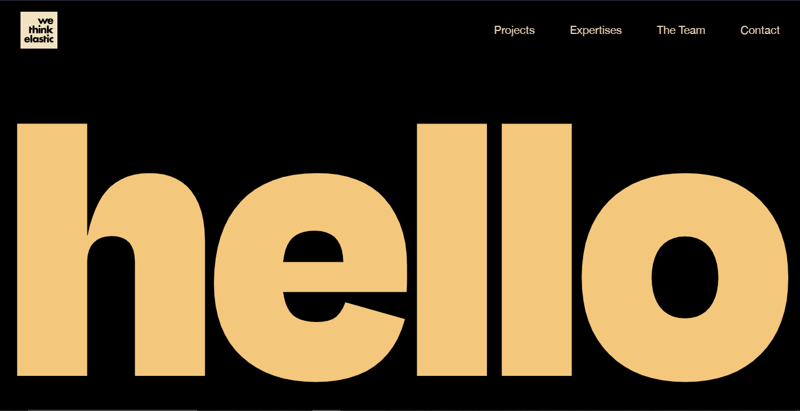

# <h1 size="80" align="center">We Think Elastic</h1>

  

<h4>This is the clone of the website https://wethinkelastic.com/</h4>

### Project Details 
#### I utilized HTML, CSS, and JavaScript to craft this website It's a clone of a website called wethinkelastic. Using GSAP, I added captivating animations that bring the site to life for smooth scrolling I've used Locomotive JS to enhance the experience 🌐✨

## Acknowledgements

 - [Harsh Sharma](https://github.com/asynchronousJavascriptor)
 - [Sarthak Sharma](https://github.com/saarthack)

## Author

 - [Sahil Pandey ⚡](https://www.github.com/pandey-sahil)
